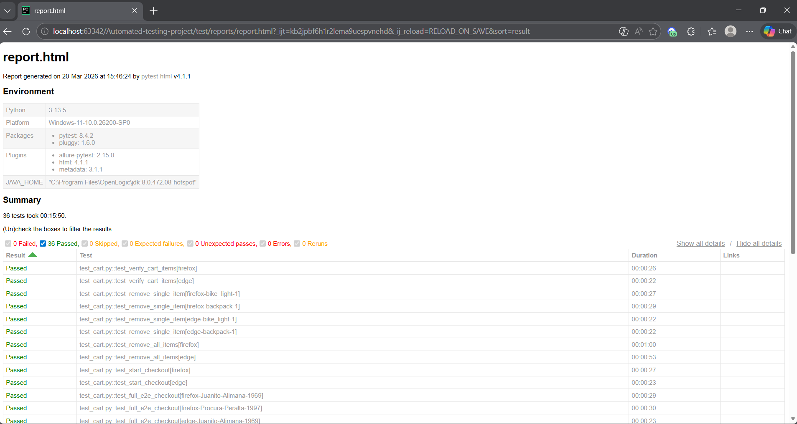

# 🛡️ Selenium + Pytest SauceDemo E2E Framework with Allure

[](https://www.python.org/)
[](https://www.selenium.dev/)
[](https://pytest.org/)
[](https://allurereport.org/)
[](https://github.com/jerryfinol17/Automated-testing-project/actions)
[](LICENSE)

**Enterprise-ready End-to-End automation framework** for SauceDemo using **Selenium WebDriver**, **pytest**, **Page Object Model** and **Allure reporting** — with rich interactive dashboards, screenshots, timelines and CI/CD artifacts.

Demonstrates key skills companies seek: stable Selenium automation, beautiful stakeholder reports (Allure), maintainable POM, data-driven tests, cross-browser, and automated pipelines.

### ✨ Key Highlights
- ✅ Full **Page Object Model** (dedicated pages + config modules)
- ✅ Cross-browser (Chrome & Firefox via WebDriver Manager)
- ✅ All SauceDemo users & edge cases (locked-out, invalid creds, empty fields)
- ✅ Comprehensive flows: login, inventory (add/multi/sort/price validation), cart (consistency/remove), full parametrized checkout E2E
- ✅ **Allure reporting** — steps, attachments, timelines, screenshots, failure details
- ✅ Pytest-HTML fallback + auto artifacts in CI
- ✅ GitHub Actions CI (runs on push/PR, green status, reports downloadable)
- ✅ Data-driven with `@pytest.mark.parametrize`

### 📁 Project Structure

```bash 
Automated-testing-project/
├── config/               # Credentials & locators per page
├── pages/                # POM core (login, inventory, cart, checkout)
├── test/                 # Test suites (login, inventory, cart/E2E)
├── reports/              # Pytest-HTML reports
├── allure-results/       # Raw Allure data
├── allure-report/        # Generated Allure dashboard
├── docs/                 # Screenshots & extras
├── .github/workflows/    # CI pipeline (main.yml)
└── requirements.txt
```

### 🚀 Quick Start
```bash
git clone https://github.com/jerryfinol17/Automated-testing-project.git
cd Automated-testing-project
pip install -r requirements.txt
```

### Run Tests:
```bash
pytest test/ -v                               # Full suite
pytest --alluredir=allure-results -v          # With Allure
allure serve allure-results/                  # Open interactive report
```

### CI Reports:
Download Allure/HTML artifacts from Actions tab after runs.
### Reporting Demo
Allure dashboard: steps, screenshots, failure reasons — perfect for sharing with PMs/devs.
(Agrega screenshot de Allure si podés: sube uno a docs/ y enlaza: Allure Sample)



### Why this Framework stands out
Classic Selenium (enterprise staple) + modern Allure reporting = combo que muchas compañías pagan bien. Listo para escalar a tu proyecto real.Open for freelance/contract QA roles (Selenium/Playwright/Python/API/CI). 

**Open for freelance/contract QA Automation roles** (Selenium • Playwright • Python • API • CI/CD).  

→ DM me on X [@GordoRelig3d](https://x.com/GordoRelig3d)  
→ Email: jerrytareas17@gmail.com

¡Tests green, reports stunning! 🏆


Built by Jerry Finol | Last Updated: March 20, 2026
